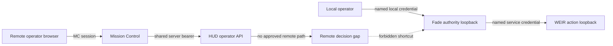
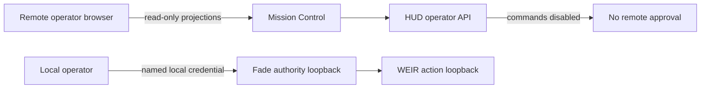
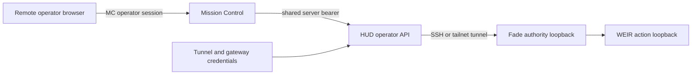
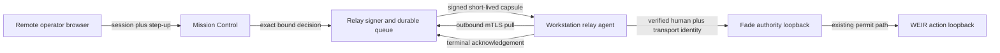

# Security Hardening Proposal: Remote Decision Capsules

## Decision

We need to choose how a remotely authenticated human can approve or deny one exact
WEIR proposal while Fade and WEIR remain workstation-local. This review recommends a
signed outbound pull relay, but does not authorize implementation or deployment. The
local Batch 9 canary remains a prerequisite because the requested reverse ordering
caused this review to precede that evidence.

## Executive Recommendation

The complete option set is:

- Option 1: retain local-only approval and keep remote commands disabled.
- Option 2: connect HUD to Fade through an authenticated SSH or tailnet tunnel.
- Option 3: issue short-lived signed decision capsules through a durable queue that a
  workstation relay agent polls outbound.

I recommend Option 3 after the local canary. It is the only option that cleanly models
offline delivery, revocation, replay, human identity, and acknowledgement without
making the Fade service remotely addressable. Option 1 remains the rollback and should
win if remote approval is not valuable enough to own a queue and signing key. Option 2
is attractive for a disposable diagnostic but should not become the authority path.

## Evidence

I inspected each source boundary named below. The facts that most influenced the
recommendation were Fade's strict loopback binding, Mission Control's loss of the human
principal when it forwards a command, and the absence of authority-grade queue
semantics in the existing HUD command receipt path.

| Evidence | Finding or document | What it establishes |
| --- | --- | --- |
| `E1` | WEIR D12 and Batch 8 decisions | Same-host proof comes first; a remote relay needs a separate threat model and must not expose workstation action services. |
| `E2` | Remaining integration sequence | The relay is gated on local acceptance and must cover identity, replay, revocation, offline approval, retention, and compromised HUD behavior. |
| `E3` | Fade WEIR authority implementation | Fade is loopback-only, authenticates named clients with distinct credentials, checks scopes, and currently records the transport principal as `actor_id`. |
| `E4` | Fade authority startup configuration | The optional `hud-gateway` principal is deliberately read-only and cannot submit a decision. |
| `E5` | HUD operator HTTP boundary | Snapshot and SSE reads are unauthenticated locally; command writes use one bearer authorizer that returns a boolean rather than a human principal. |
| `E6` | HUD command gateway | Commands are bounded and idempotent, but the gateway does not define expiry, claim, revocation, or workstation acknowledgement semantics. |
| `E7` | HUD live registry | WEIR is not yet registered and no WEIR command definition exists. |
| `E8` | HUD WEIR projection | The projection already carries only redacted identifiers and state; it excludes action parameters and reusable authority. |
| `E9` | Mission Control command route | An authenticated `operator` can submit a strict command, but the route forwards only the command object and discards the authenticated user's identity. |
| `E10` | Mission Control HUD client | The next hop uses one server-side bearer credential, so it cannot by itself prove which human approved. |
| `E11` | Mission Control request edge | Host allowlisting, session/API authentication, public-origin command denial, and Origin checks protect the web edge but do not create a portable decision proof. |
| `E12` | Mission Control/HUD boundary documentation | Mission Control is intentionally not the authority for Lugos approvals or receipts. |
| `E13` | Tailscale connectivity notes | A private carrier may be available, but network membership is deployment state and does not supply application-level operator identity. |

Observed: the current remote UI path ends at HUD and cannot call Fade. Observed: the
two existing authenticated hops collapse the human into a shared service credential.
Inferred: directly connecting those hops would make audit attribution depend on logs
and convention rather than a cryptographically bound decision object. That structural
condition is why we need a capsule, not merely another URL.

## Current Design And Failure Mode

Today the remote browser authenticates to Mission Control. Mission Control validates a
closed operator command and calls the HUD operator API with a shared bearer. HUD owns
idempotent receipts for its current commands, while Fade separately accepts named local
clients and reloads the authoritative WEIR proposal before issuing a permit. There is no
network edge between HUD and Fade, by design.

If we add only a tunnel, the shared HUD credential becomes effective remote authority.
The workstation cannot distinguish Alice from Bob, an approval can wait in an
unmodelled retry buffer, and revocation has no durable state. If we repurpose Agent Mail
or a generic job queue, the message body can become an accidental parameter channel and
ordinary redelivery can become an action replay. Neither failure is fixed by TLS; TLS
authenticates a connection, not the complete decision lifecycle.

## Desired Invariants

- Every remote approval is a signed, immutable capsule bound to exactly one
  `command_id`, `proposal_hash`, `action_id`, and `work_context_hash`.
- The capsule contains no action parameters, DOM, prompt text, credentials, evidence
  bodies, cookies, private profile identifiers, or permit material.
- Fade independently reloads the proposal and records both the authenticated human
  actor and the authenticated relay transport principal.
- An approval is accepted only while `issued_at <= now <= expires_at + 5 seconds`; an
  offline workstation never executes an approval after expiry.
- Queue claim, acknowledgement, expiry, and revocation are durable and idempotent.
- The relay agent checks revocation after claim and immediately before local dispatch.
  Revocation after Fade begins permit issuance is recorded as too late, never invented
  as a successful cancellation.
- A browser or HUD frontend can select identifiers but cannot restate parameters, sign
  a capsule, or obtain a reusable relay credential.
- A denied, expired, revoked, malformed, replayed, or ambiguously acknowledged capsule
  produces a durable terminal state and no effect.
- Fade and WEIR continue to reject non-loopback binds.

## Constraints And Non-Goals

The first remote scope remains the synthetic public-data action policy. This design is
not permission for purchases, messages, account changes, credentials, uploads, or
production form submissions. It does not make Mission Control the permit authority;
Fade still decides whether to issue the frozen WEIR permit after verifying a decision.

The transport may run over a tailnet, LAN, or normal HTTPS. Carrier security is useful
defense in depth but cannot replace per-device authentication, capsule signatures, or
expiry. No measured latency or queue-volume budget exists yet, so the validation plan
uses explicit provisional thresholds.

## Before Architecture

The safe property in this view is the gap: a remote component cannot reach the action
authority. Our replacement has to preserve that containment while carrying a more
precise object than the current shared-bearer command hop.

## Options

### Option 1: Keep approval local

We can keep remote WEIR projections read-only and require the operator to approve from
the workstation. This preserves every existing boundary and adds no cryptography,
queue, process, or operational dependency. Its strongest case is that remote approval
may be a convenience rather than a requirement; in that case, local presence is a
useful security control rather than a missing feature.

The cost is functional: alerts can be viewed remotely but not resolved remotely, and a
time-sensitive proposal may expire before the operator reaches the workstation. There
is no migration risk and rollback is simply the same state. If the local canary exposes
instability, this option should remain selected indefinitely.

| Change | Before | After | Security consequence | Cost |
| --- | --- | --- | --- | --- |
| Remote decisions | Absent | Still absent | No new remote authority | Remote operator cannot act |
| Workstation ingress | None | None | Loopback containment unchanged | None |
| Durable relay state | None | None | No replay surface | No offline workflow |

### Option 2: Tunnel HUD to Fade

An SSH reverse tunnel or tailnet route could connect the host-side HUD process to a
workstation loopback port. This is operationally attractive because the portfolio
already understands SSH and may have Tailscale transport. It adds little application
code and gives low latency while the tunnel is live.

What gives me pause is that the tunnel converts a network path into direct service
authority. The current HUD hop uses a shared bearer and discards the human principal,
so Fade would see a gateway rather than an operator. Connection retries also do not
provide explicit offline expiry or revocation. We could add those controls around the
tunnel, but at that point we have built most of the capsule protocol while retaining a
long-lived inbound path. Use this only as a short diagnostic with decision writes
disabled; do not promote it to production approval.

| Change | Before | After | Security consequence | Cost |
| --- | --- | --- | --- | --- |
| Connectivity | No remote Fade path | Persistent tunneled path | Host compromise can reach Fade | Tunnel supervision |
| Identity | Local named principal | Shared HUD gateway | Human attribution is lost | Audit correlation work |
| Offline handling | Not applicable | Connection retry behavior | Delayed/replayed intent is ambiguous | Custom retry controls |
| Rollback | Commands absent | Tear down tunnel and credential | Recoverable if credential is revoked | Operational coordination |

### Option 3: Signed outbound pull relay

We can introduce one narrow relay issuer and queue next to the remote operator surface,
plus one supervised workstation agent. Mission Control reloads the redacted proposal
row, verifies the operator role and a step-up assertion, and submits exact identifiers
to the issuer. The issuer persists a bounded queue record and signs a canonical capsule
containing the human subject, issuer, audience, device target, identifiers, issue time,
expiry, nonce, and decision. It never accepts or emits action parameters.

The workstation agent authenticates with a distinct per-device credential, polls
outbound, verifies the issuer signature and pinned audience, claims one capsule, checks
revocation, and presents it to a new Fade loopback relay endpoint. Fade re-verifies the
signature, clock, decision bindings, and transport identity; reloads the proposal; and
records `actor_id` separately from `transport_principal`. Its existing permit issuance,
WEIR execution, status reconciliation, and unknown-outcome behavior remain in charge.

The queue state machine is `queued -> claimed -> acknowledged` with terminal
`denied`, `expired`, or `revoked` branches. A claim is not execution authority. If the
agent disappears before local dispatch, its short claim lease can be retried only while
the capsule remains live. If dispatch becomes ambiguous, the agent acknowledges
`outcome_unknown` using the existing command binding and never asks for a second effect.

This option introduces a signer and durable queue. The signer key must be separated
from database contents, rotated with overlapping public verification keys, and denied
to browser code. A compromised Mission Control backend remains inside the issuer trust
boundary; WebAuthn/passkey user verification makes a stolen session or compromised HUD
frontend insufficient, but full host compromise is residual risk. If the project is
unwilling to own that key lifecycle, Option 1 is safer than weakening Option 3.

| Change | Before | After | Security consequence | Cost |
| --- | --- | --- | --- | --- |
| Human identity | Lost after MC route | Signed subject plus step-up evidence | Fade can attribute the actual approver | Identity/schema work |
| Connectivity | No cross-host path | Workstation-originated authenticated pull | Fade remains unreachable from the host | Supervised agent and HTTPS/mTLS |
| Replay control | Per-hop idempotency only | Signed nonce, expiry, unique command, durable claim/ack | Delayed and duplicate deliveries fail closed | Queue state and cleanup |
| Revocation | Undefined | Durable pre-dispatch revoke plus final online check | Queued authority can be withdrawn | One additional round trip |
| Parameters | Closed today but generic payload exists | Capsule exact-set forbids them | Relay cannot become a parameter channel | Dedicated contract |
| Rollback | Remote command absent | Disable issuer and relay agent | Local approval remains available | Preserve queue audit records |

## Comparison

| Dimension | Option 1: local only | Option 2: tunnel | Option 3: signed pull relay |
| --- | --- | --- | --- |
| Security | Strongest boundary; no remote authority | Regresses by creating a direct path and shared gateway authority | Improves identity, replay, expiry, and revocation while preserving loopback |
| Performance | No remote path | Lowest added latency; source-derived | Adds polling, signature, and acknowledgement; hypothetical p95 target under 2 seconds |
| Memory | Neutral | Neutral beyond tunnel process | Small bounded agent plus queue; cap live entries at 1,024 and capsule at 8 KiB |
| Reliability | Local only | Coupled to live tunnel; retry ambiguity | Durable delivery and explicit terminal states, with more components to operate |
| Operability | Minimal | Tunnel credential and supervision | Signer key, mTLS/device credentials, queue monitoring, clock monitoring, agent lifecycle |
| Migration | None | Small code change, risky authority expansion | Versioned additive path kept disabled until canary and staged rollout |
| Rollback | Already rolled back | Remove tunnel and rotate gateway credential | Disable enqueue/poll, revoke device credential, retain records |

These assessments are source-derived except the latency and resource bounds, which are
hypotheses. Measure 1,000 synthetic decisions across normal and degraded links; require
p95 enqueue-to-claim below 2 seconds, zero deliveries after expiry/revocation, a hard
8 KiB capsule limit, and bounded memory at the 1,024-entry live-queue cap. If normal
network behavior cannot meet the expiry budget without relaxing authority lifetime,
keep approval local rather than lengthening the window.

## Recommendation

I recommend Option 3 under the current constraints. It makes the asynchronous state
explicit instead of disguising it as transport retry, and it lets Fade validate a
portable human decision without accepting remote action parameters. The extra service
state is justified only after the local canary proves the underlying action path.

Option 1 becomes preferable if remote approval volume is rare, WebAuthn/passkey step-up
cannot be deployed, or no team owns signer-key and queue operations. Option 2 becomes
reasonable only for a read-only diagnostic tunnel; it should not carry decisions.

## Evidence Coverage And Residual Risk

| Evidence | Option 1 | Option 2 | Option 3 | Tactical protection still required |
| --- | --- | --- | --- | --- |
| `E1` — D12 loopback boundary | Addresses | Mitigates only through tunnel encryption | Addresses with outbound-only agent | Fade and WEIR loopback bind checks remain |
| `E2` — relay threat-model requirements | Unaffected because relay absent | Unknown or incomplete | Addresses identity, replay, revocation, offline, retention | Local canary prerequisite remains |
| `E3`/`E4` — Fade named principals | Preserves | Collapses human into gateway | Extends to separate human and transport identities | Existing distinct credentials remain |
| `E5`/`E6` — HUD bearer and receipts | Preserves but does not use for action | Mitigates only idempotency | Replaces authority transfer with capsule lifecycle | Existing command validation remains |
| `E7`/`E8` — dormant redacted projection | Preserves | Uses identifiers but adds direct reachability | Uses only redacted exact bindings | Construction-time redaction remains |
| `E9`/`E10` — MC human identity loss | Unaffected | Unaffected | Addresses with signed subject and step-up | MC role checks and no browser secret remain |
| `E11` — web-edge controls | Preserves | Relies heavily on them | Mitigates browser/session compromise with step-up | Host allowlist, CSRF, secure cookie, CSP remain |
| `E12` — authority ownership | Preserves | Risks making HUD effective authority | Preserves Fade as permit authority | Fade reloads authoritative proposal |
| `E13` — private carrier | Unaffected | Uses carrier as authority-adjacent path | Uses carrier only as defense in depth | Application mTLS and signatures remain |

Residual risks include compromise of the relay signer host, coercion of a legitimate
operator, endpoint compromise before the step-up assertion, clock failure outside the
five-second skew budget, and denial of service against the queue or poller. No relay
design can revoke an action after Fade has crossed its durable dispatch marker; the UI
must state that boundary plainly.

## Migration And Rollout

Keep the existing local path and all source feature flags. Introduce capsule fixtures
first in Mission Control, HUD/relay, Fade, and WEIR integration tests. Add the queue and
signer disabled, then add a no-effect workstation verifier that can only fetch and
reject/ack fixtures. Add step-up and operator identity propagation before decision
write scope. Only after the local Batch 9 canary and an independent relay review may a
synthetic approval reach Fade.

Start with one workstation, one operator, public data, and the existing synthetic
reversible allowlist. Monitor claim age, expiry, revocation, signature failures,
duplicate delivery, clock skew, and ambiguous acknowledgement. Rollback disables
enqueue and the workstation poller, revokes its credential, and preserves capsules,
claims, acknowledgements, Fade runs, permits, receipts, and quarantine records for the
declared audit period.

## Validation Plan

- Contract: reject unknown fields, parameters, wrong audience/device, altered hashes,
  invalid signatures, wrong key IDs, oversized capsules, and non-canonical encodings.
- Identity: prove two operators produce distinct actors while the same workstation
  transport principal remains separately visible; a shared bearer cannot impersonate
  either actor.
- Replay: duplicate enqueue, delivery, claim, and acknowledgement converge on one
  command and one Fade run; conflicting reuse returns an idempotency conflict.
- Time: exercise clock skew at `-6`, `-5`, `+5`, and `+6` seconds; offline capsules
  expire without local dispatch.
- Revocation: revoke before claim, during claim lease, and immediately before dispatch;
  all pre-dispatch cases produce no effect.
- Compromised HUD: submit replacement identifiers, omitted step-up, stolen session,
  generic payload fields, and parameters; none reaches the signer as an approval.
- Ambiguity: drop each response after queue reserve, claim, Fade dispatch, and terminal
  acknowledgement; no path produces a second effect.
- Resources: 1,000 synthetic decisions, 1,024 queued entries, 8 KiB maximum capsules,
  and slow-consumer backpressure without unbounded memory or queue growth.
- Operations: key rotation overlap, device credential revocation, signer restart,
  workstation restart, queue backup/restore, and fail-closed clock-monitor failure.

## Implementation Work Packages

- Freeze `RemoteDecisionCapsule/v1`, queue-state, acknowledgement, and redacted audit
  fixtures, including actor/transport separation and the five-second skew rule.
- Add Mission Control server-side proposal reload, exact command construction, operator
  identity binding, and WebAuthn/passkey step-up for approvals.
- Add a least-privilege relay signer/queue service with append-only transitions,
  per-device mTLS, expiry/revocation checks, bounds, metrics, and key rotation.
- Add a supervised workstation pull agent with pinned issuer keys, outbound-only
  transport, durable local dedupe, and parameter-free logging.
- Add a Fade loopback relay endpoint that validates capsules and records human plus
  transport identities before invoking the existing coordinator.
- Add cross-repository negative and restart tests, then one synthetic remote canary.

## Open Questions

- Which deployed identity provider and operator device will own WebAuthn/passkey
  enrollment and recovery?
- Will the relay queue live beside Mission Control or as a separate HUD-host service?
  A separate least-privilege service is preferred if operations can support it.
- What audit-retention period already governs operator receipts? Capsule bodies should
  be deleted promptly after terminal state while hashes and redacted metadata follow
  that existing period.
- Which hostname and CA will provide workstation-to-relay mTLS? Tailscale transport may
  be used only after its actual deployment state and ACLs are verified.

